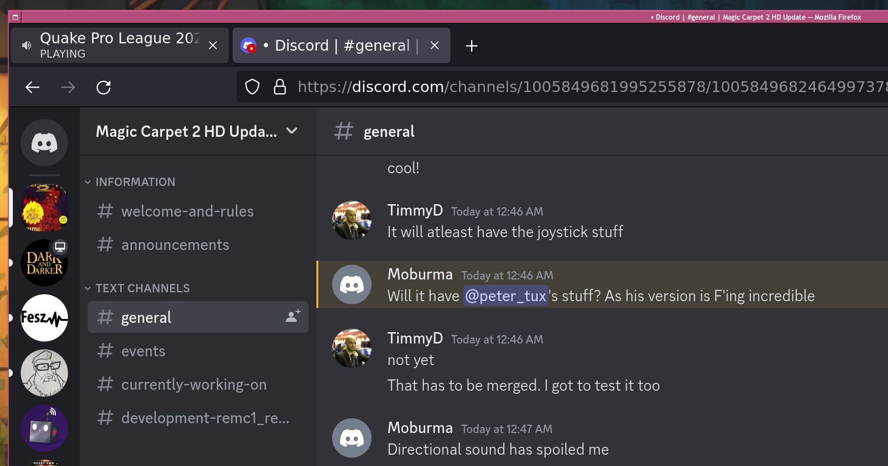

# Magic Carpet 2
Based off the Reverse engineering of game Magic Carpet 2 from assembler to c/c++ language by Tomas Versly <br />
Forked from Tomas Vesely's repo here: https://github.com/turican0/remc2 <br/><br/>

## about this fork

this is a Linux and FreeBSD targeted repository and changes include:

 - major cleanup of the repository
 - added check/install script
 - added joystick/controller support
 - added haptic support
 - rewritten OpenAL support from scratch, now with positional audio
 - add playback of audio tracks containing the narrator voice-over
 - fixes for various crashes

see the ChangeLog for a more detailed list.

## building

### Gentoo Linux

if you use Gentoo, this game is part of my [overlay](https://github.com/rodan/overlay).
so compilation is as simple as

```
emerge mcarpet2
```

### manual compilation mode

  1. Get the entire repository recursively
```
git clone --recurse-submodules https://github.com/rodan/magic_carpet_2.git
```
for already cloned repos
```
cd magic_carpet_2 && git submodule update --init --recursive
```
  2. On Linux recent `make` and `gcc` are needed. On FreeBSD the stock make and clang will get used.
  3. Make sure that you have the following dependencies as development packages (the exact names depend on your distro)
  - cmake
  - SDL2
  - SDL2_mixer
  - SDL2_image
  - SDL2_ttf
  - libpng
  - boost
  - OpenAL
  - spdlog
  - zlib
  - libfmt
  4. Build the code

```bash
cd magic_carpet_2
export BUILDTYPE=Debug # or Release
mkdir -p build
cd build
cmake -DCMAKE_BUILD_TYPE=${BUILDTYPE} -DCMAKE_INSTALL_PREFIX=./inst ../
make
make install
```

  5. Magic Carpet 2 is now built. you can find it in `build/inst/bin`
     - You can also run the code with sanitizers (leak, address, undefined behaviour, pointers) by passing `-DUSE_SANITIZERS=True` to CMake
     - Additionally you can compile the code with clang-tidy analyzers by passing `-DUSE_CLANG_TIDY=True` to CMake

## installing game assets and running the game

In order to run the game you need to own a copy of Magic Carpet 2. We provide a script to extract the assets from the GOG version. The following steps extract the required files from the original.
  1. Purchase a copy of Magic Carpet 2 from GOG here: https://www.gog.com/game/magic_carpet_2_the_netherworlds
  2. Install the game
  3. In order to retrieve the original game's assets run the following script located in the root of the repository:

  ```
  mcarpet2_install.sh -s [directory where GOG installed MC2] -d [destination directory]
  # for example :
  mcarpet2_install.sh -s "${HOME}/.wine/drive_c/games/Magic Carpet 2/" -d ${HOME}/games/mcarpet2/
  ```

In case you already have the original game on CD, please follow these steps:
  1. place CD into drive and verify that it can be read
  2. run the following script, providing the correct device as source:

  ```
  mcarpet2_install.sh -s /dev/cdrom -d [destination directory]
  # for example :
  mcarpet2_install.sh -s /dev/sr0 -d ${HOME}/games/mcarpet2/
  ```

  Please note that if you have used any other method to get the assets, at least run a check to make sure that remc2 has access to every file it needs:

  ```
  mcarpet2_install.sh -d [destination directory]
  # for example:
  mcarpet2_install.sh -d ${HOME}/games/mcarpet2/
   [ ok ] CD_Files directory
   [ ok ] GAME directory
   [ ok ] recode engine
  ```

  this script will fix the permissions, make everything uppercase, check all file hashes and complain if any file is missing.
  it's also recommended that before the first run you remove the file GAME/NETHERW/CONFIG.DAT if it exists.

  4. NOTE: The game will search in the following locations (and in this particular order) for the game assets. For the flatpak only the first two locations can be used.
     1. `$XDG_DATA_HOME/remc2/`
     2. `$HOME/.local/share/remc2`
     3. next to the `remc2` binary

  5. try out the game engine via the provided wrapper

  ```
  mcarpet2
  ```

  6. get the optional HD textures and synth-generated soundtrack with

  ```
  mcarpet2_install.sh -x -d [destination directory]
  ```

  7. Tweak the options in ```~/.config/mcarpet2/config.ini```

## runtime configuration

Some settings can be configured via the file `config.ini`. An example for this file can be found in the root directory of the `remc2` repository.
The game will search for this file in the following locations and this particular order. For the flatpak only the first two locations can be used.
1. `$XDG_CONFIG_HOME/remc2`
2. `$HOME/.config/remc2`
3. next to the `remc2` binary

## testimonials



you are in the presence of greatness.

## License ##
### Original Source Code is Copyright 1995 Bullfrog Productions ###

### Additonal Code is Licensed under the following MIT Licence: ###
Copyright 2022 Magic Carpet 2 HD

Permission is hereby granted, free of charge, to any person obtaining a copy of this software and associated documentation files (the "Software"), to deal in the Software without restriction, including without limitation the rights to use, copy, modify, merge, publish, distribute, sublicense, and/or sell copies of the Software, and to permit persons to whom the Software is furnished to do so, subject to the following conditions:

The above copyright notice and this permission notice shall be included in all copies or substantial portions of the Software.

THE SOFTWARE IS PROVIDED "AS IS", WITHOUT WARRANTY OF ANY KIND, EXPRESS OR IMPLIED, INCLUDING BUT NOT LIMITED TO THE WARRANTIES OF MERCHANTABILITY, FITNESS FOR A PARTICULAR PURPOSE AND NONINFRINGEMENT. IN NO EVENT SHALL THE AUTHORS OR COPYRIGHT HOLDERS BE LIABLE FOR ANY CLAIM, DAMAGES OR OTHER LIABILITY, WHETHER IN AN ACTION OF CONTRACT, TORT OR OTHERWISE, ARISING FROM, OUT OF OR IN CONNECTION WITH THE SOFTWARE OR THE USE OR OTHER DEALINGS IN THE SOFTWARE.
